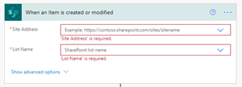

# Message Center in Teams

## Description

Message Center in Teams is a simple PowerAutomate Solution to gather Message Center Announcement and post them in a Teams Channel.
Its goal is to leverage Teams and SharePoint list to ease the access and simplify sharing of message center announcement.


## Deployment steps

  - [PreReqs](#prereqs)
  - Azure AD
    - [Create the Azure AD App Id](#create-the-azure-ad-app-id)
  - Microsoft Teams
    - [Create the Microsoft List in the team of your choosing](#create-the-microsoft-list-in-the-team-of-your-choosing)
  - PowerAutomate
    - [Import the 3 flows in PowerAutomate](#import-the-3-flows-in-powerautomate)
    - [Configure the **Initiate MC** flow](#configure-the-initiate-mc-flow)

### PreReqs

- This solution require at least 1 PowerAutomate user license for the person that will import the flows, they use Premium Connector to query the management API.

- You will need Azure AD administrator priviledge to [register your app](https://docs.microsoft.com/en-us/azure/active-directory/develop/howto-create-service-principal-portal#permissions-required-for-registering-an-app) and [consent permission for your app](https://docs.microsoft.com/en-us/azure/active-directory/manage-apps/grant-admin-consent#grant-admin-consent-in-app-registrations).

### Create the Azure AD App Id

Create an Azure AD app to Query the Message Center API.

- Go in App Registrations view in [Azure AD admin portal](https://aad.portal.azure.com/#blade/Microsoft_AAD_IAM/ActiveDirectoryMenuBlade/RegisteredApps)

    

    Click register a New apps in your tenant.
- Name it accordingly and keep the default configuration

    

- Please keep the application ID and Tenant ID that will be needed for later use

    

- Open the API Permissions view and Click “+ Add a permission”

    

- Choose Office 365 Management API

    

- Choose Application permissions for later use in the Power Automate

     

- Select ServiceHealth.Read

    

- Remove the Default Microsoft Graph Permission (User.Read)
    

- Grant Admin Consent for your tenant (Extra permission Required see PreReqs)

    
    

- Go in Certificates & Secrets section to generate a new Client secrets

    

- Name it and choose an expiry date according to your security practice

    

- Save the Generated Secret for later use, it cannot be displayed again

    

### Create the Microsoft List in the team of your choosing

- Open in Teams the team (you are an owner of) you want the solution to be available in

    

- Click the + sign and add Lists as a tab in the general channel

    
    

- In the Lists Tab click Create a list

    

- Click the From Excel button and upload the list template you can find in the Lists Export folder

    
    

- Make sure you configure the right column types for each one

    

    Title > Title

    Product > Single line of text

    PublishedTime > Date and time

    LastUpdate Message > Multiple lines of text

    LastUpdate Time > Date and time

    MessageID > Single line of text

    MessageText > Multiple lines of text

- Finish the list creation by giving it a name, description, an icon and a color


- Edit List fields to support rich text, right click on MessageText, Column settings & Edit


- Click on **More options** and make sure that the **Use enhanced rich text** check box is on and click Save


- Do the same for the column **LastUpdate Message**
- Opne the list in SharePoint Online


- Modify the current View to improve the presentation of MC


- Change the Column displayed : Title (linked to item), Product and PublishedTime in that order


- Change host sort the items : sort by PublishedTime in ascending order


### Import the 3 flows in PowerAutomate

- Download the flows that are [available here](https://github.com/ericsche/MCinTeams/tree/main/PowerAutomate%20Exports)

- Connect to [PowerAutomate](https://flow.microsoft.com/) with a user that has a **PowerAutomate user plan** license
  
- Navigate to the **My flows** page and click the Import button


- Look for the flows and upload the first one


- You will be asked to updates some for the flow informations before you can more forward. Feel free to update the name of the flow and marke sure you import connections so PowerAutomate can connect to the List and Teams. The account you should should be at least a member of the team you should to host the List and the channel where the message will be posted.


> **Note:** For the Microsoft Teams connection you can either use your account or a resource account that will avoid you all the notifications from likes & comments if needed.

- Reapeat the same steps for all flows

### Configure the **Initiate MC** flow

- Click the **Edit** button for the Initiate MC flow


- Now update every variables at the beginning of your flow : **TenantID, ClientID, AppSecret, SharepointSiteURL, ListName**


> **Note:** **TenantID, ClientID & AppSecrets** are values you saved from the [Create the Azure AD App Id](#create-the-azure-ad-app-id) section.
> **SharepointSiteURL** should be the base URL of the SharePoint Site backing up the team you hosted the solution in. It should look like ```https://TENANT NAME.sharepoint.com/teams/TEAM NAME/```.
> **ListName should** be the full name of the list you created in the [Create the Microsoft List in the team of your choosing](#create-the-microsoft-list-in-the-team-of-your-choosing) section.

### Configure the **Get New MC** flow

- Click the **Edit** button for the Get New MC flow
- Now update every variables at the beginning of your flow : **TenantID, ClientID, AppSecret, SharepointSiteURL, ListName**

### Configure the **Post in Teams - Teams MC** flow

- Click the **Edit** button for the Get New MC flow
- Edit the flow trigger : **When an Item is created or modified** make sure you select the Sharepoint site hosting the solution and the List storing the messages.
  
    

- Now update every variables at the beginning of your flow : **TenantID, ClientID, AppSecret, SharepointSiteURL, ListName**
